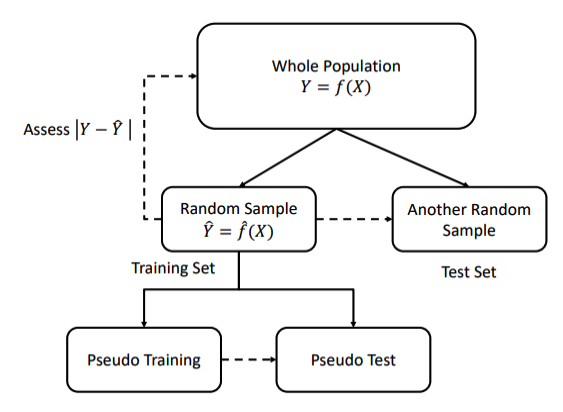
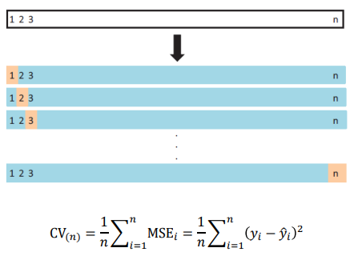
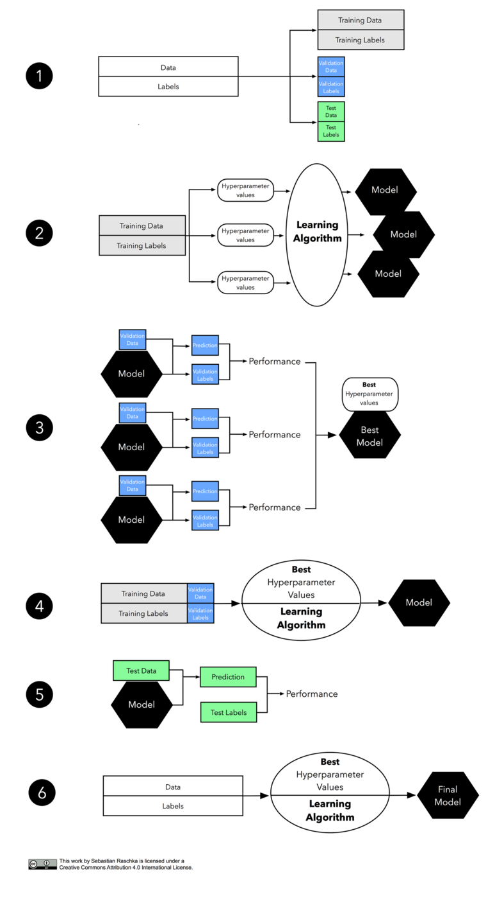
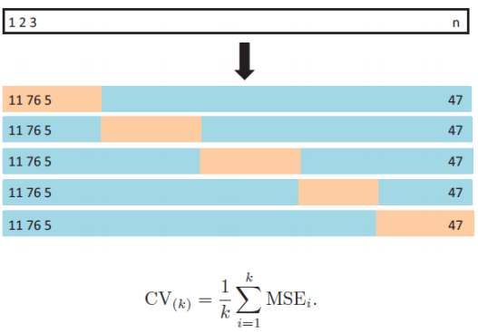
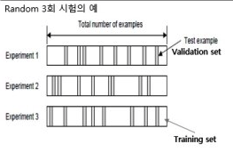

# Week 12 : Bayesian Network, Cross Validation, Gradient Descent Optimization

# Cross Validation 교차 검증

## 요약

- 기계학습 모델은 학습하기 위해서 데이터셋을 필요로 한다.
- 데이터셋은 모델을 학습시키기 위해서 사용하기도 하지만, 모델의 성능을 평가하는데 사용된다.
- 학습과 성능 평가를 위해서 training, testing dataset으로 구분한다.
- 학습과정에서 여러 모델이 생겨난다. (파라미터 튜닝을 하는 이유)
- 이들 모델을 선택할 때, 모델의 bias, variance를 측정하는 것은 중요한 과정이다.
- cross-validation dataset은 모델의 bias, variance를 측정하는 기준으로도 사용한다.

* 우리가 만든 모델의 적합성을 보다 객관적으로 평가하기 위한 방법중의 하나
* 충분한 데이터가 확보되지 않은 상황에서 데이터 분석을 수행할 경우 통계적 신뢰도를 높이기 위하여 사용되는 방법

## 교차 검증?

* Whole population(모집단)에서 Y와 f를 구하기 위해

  Training Set(모집단에서 나온 데이터셋)에서 f와 똑같지 않지만 비슷한 모델 f^를 만듦

* 이 모델을 모집단에서 나온 또 다른 데이터 셋인 Test Set을 이용하여 확인

  (일반적으로 Test Set이 별도로 존재하는 경우가 많지 않기 때문에 Training Set을 2개의 데이터셋으로 나눔)

* Training Set에서 Training Set과 Test Set을 어떻게 나누느냐에 따라 모델의 성능이 달라질 수 있다.

* 이런 테스트 방법을 **교차 검증**이라고 함

## LpOCV (leave-p-out cross validation) 

* 가능한 경우의 수 만큼 모두 반복
* n : 전체샘플 수
* P : 가능한 Validation Set의 데이터 수
* 따라서 n이 커지면 연산이 복잡해짐

## LOOCV (leave-one-out cross validation) 

* N 개의 데이터 샘플에서 한 개의 데이터 샘플을 test set 으로 하고,

  1개를 뺀 나머지 n-1 개를 training set으로 두고 모델을 검증

* 전체 샘플 수 n 만큼 반복

* Leave-p-out CV의 p=1인 특수한 경우

* k-fold CV의 k=n(폴드의 수 = 전체 샘플 수)인 경우도 동일

* 계산의 어려움은 없음

* 에러 평가

  * 

* 작은 데이터셋에 유용 (n번 반복해야 해서 계산비용 많이 필요)

* test set이 하나의 샘플만 담고 있어서 분산이 큼

* 하나의 관측치에 기반 —> 번동이 심함

## Holdout Cross Validation

 Hold Out Method : Training Set으로 훈련하고 빼놓았던 Validation Set으로 검증하는 기본 기법

   \- subset을 Resampling 하는 방법에 따라 다양한 기법이 존재함

* 데이터를 Training Set과 Validation Set으로 분리 

* Training Set으로 학습 
* Validation Set으로 검증
* ①~③반복 수행 후 , 오류의 평균으로 평가

### 장점

* 데이터 셋이 충분히 클 경우 계산의 효율성이 좋음

* 3방향 홀드아웃은 k-fold CV 보다 연산 비용이 저렴 —> 선호됨

* 연산의 효율성을 제외하고 비교적 큰 샘플 크기를 가지고 있을 때 딥러닝 알고리즘을 사용한다면,

   데이터셋을 훈련, 검증, 테스트용으로 어떻게 분할하느냐에 따라 추정이 민감해지는 분산에 대해 걱정할 필요가 없다

* 비교적 샘플 사이즈가 클때 모델 평가로 아주 적당 

* 모델 선택에서는 연산 비용의 제약 때문에 3방향 홀드아웃 방식 채택

* 모델 평가시 레이블된 데이터를 새로 구하기 어려운 현실적인 제약을 해결하려고 사용

## KFCV (K-fold CV)

* n개의 데이터를 랜덤하게 섞어 균등하게 k개의 그룹(subset)으로 나눔
* 한 개의 그룹이 test set이고 나머지 k-1 개의 그룹들이 training set이 되어 k번을 반복함
* LOOCV도 n-fold CV로 볼 수 있음
* 가장 널리 쓰임
* 균일하게 분할한 K가 반드시 한번씩은 validation set(=test set) 또는 training set 으로 쓰임
* k-fold CV는 Hold Out Method과 Leave-One-Out CV 기법의 중도적 기법
* 오류 평가
  * 

### k（파라미터）가 작을 경우

- k가 너무 작으면 추정값의 비관적 편향이 증가되고(모델 학습에 더 적은 훈련 데이터가 사용되기 때문에), 

  데이터를 어떻게 분할하느냐에 모델이 더 민감해지기 때문에 추정의 분산도 증가될 것

## RLT (Repeated Learning-Testing )

Random 3회 시험의 예시

* random 하게 training set, validation set 을 분리함
* validation set을 빼놓고 나머지를 training set으로 훈련
* validation set으로 Error Ei 계산
* 차례대로 2,3번 과정을 2회 더 반복
* 평균 오류를 계산
  * 에러 평가

* 이때, 각 subset은 균일할 수록 좋음

### Monte-Carlo CV

* RLT에서 Random 복원 추출(중복 허용)인 경우가 Monte-Carlo CV

## 정리

* LpOCV, LOOCV 를 묶어서 Exhausive CV로 분류함
* KFCV, RLT는 Non-exhausive CV로 분류함
  * Non-Exhaustive CV는 Random 부분 추출기법이며 Exhausive-CV의 근사치임
