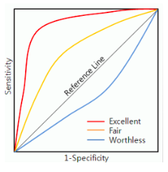

# Confusion Matrix

* 클래스 분류의 결과를 정리한 표

* 분류 모델이 정확한지 평가할 때 활용
* 머신러닝이나 통계적인 classification 문제에서 알고리즘의 성능을 visualization하는 table layout.

* 트레이닝 된 머신의 예상값과 실제 값을 비교하는 표

* 불균형한 Data set

  * ex) 14세 이하 10만명당 암 발병인원 14.8명. (암 발병 확률 : 0.014%)

    —> 굳이 머신러닝을 이용하지 않아도 확률이 너무 낮아서 '무조건 암이 아니다' 라고 해도

    정확도(Accuracy)가 99~100%이 나옴. —> 좋은 모델 X --> Confusion matrix 사용

## Positive & Negative

* 이항분류를 할 때 두가지 분류 중 한가지 분류에 더 관심이 많음
* ex) 화재 경보기 —> 화재 vs 일상 중 화재에 더 관심이 많음
* 이 때 **관심이 더 많은 쪽을 Positive, 그 반대를 Negative** 라고 함 

### TP, TN, FP, FN

> Actual condition : 실제 값, Predicted condition : 예상 값

* True Positive (진양성) : 예측과 실제 모두 P
* True Negative (진음성) : 예측과 실제 모두 N
* False Positive (위양성) : 실제로는 N인데 P로 예측된 것
* False Negative (위음성) : 실제로는 P인데 N으로 예측된 것

* 앞의 T & F : 예측이 맞았는지 틀렸는지
* 뒤의 P & N : 예측을 Positive로 했는지, Negative로 했는지

이 4가지 경우를 조합하여 여러가지 지표를 만들수 있음

## Error, Accuracy

* Accuracy (정확도) : 전체 중에서 올바르게 예측한 것이 몇개인가? (1에 가까울 수록 좋음)

* TP와 TN을 더하여, 전부의 합계로 나눔

## True Positive Rate, False Positive Rate

* True Positive Rate (진양성률) : 실제로 양성인 샘플에서, 양성이라고 판정된 샘플의 비율
  * 
  * **검출률(Recall),** **감도(Sensitivity)**, 히트률(Hit Rate), 재현률 등이라고도 함.
  * 의미 : 전체 내가 맞추려는 것 중에서 내가 몇개를 맞췄는가? (1에 가까울 수록 좋음)

* False Positive Rate (위양성률) : 실제에는 음성인 샘플에서, 양성으로 판정된 샘플의 비율
  * **FP/(FP + TN)**
  * 오검출률, 오경보률 이라고도 함

## True Negative Rate (=Specificity)

* True Negative Rate (진음성률) : 실제로 음성인 샘플에서, 음성인 것으로 판정된 샘플의 비율

* **특이도 (Specificity)** 라고도 함

### Sensitivity & Specificity

이 두가지는 특히 중요한 척도라고 한다!
[여기](https://www.youtube.com/watch?v=U4_3fditnWg) 영상 참고

## Precision

* Precision (정밀도) : 양성으로 예측한 경우 중 진양성인 경우. 양성예측이 얼마나 정확한지!

* 정밀도에 대한 판단은 **양성의 경우를 계산하는 것**이 더 좋은 방법!

  * 양성예측의 경우, 예측 후 어떠한 행동이 뒤따르는 경우가 많음

    ex) 암 치료나 화재 대피 등.. 이 정밀도가 낮으면 불필요한 행동들을 해야할 수도 있음

  * 음성 예측의 경우, 확인이 어려움

    ex) 면접에서 안 뽑은 사람이 실력자인지 아닌지는 같이 일해보지 않으면 모름

* Positive Predictive Value (PPV) 라고도 함

* 의미 : 푼 문제 중에 맞춘 정답 개수가 몇개인가? (1에 가까울 수록 좋음)

## F1-score

* Precision과 Recall의 조화 평균을 이용하여 2개를 모두 고려해서 평가하는 방법
* 데이터 자체에 Positive 또는 Negative가 많을 경우에는 비율 자체가 편향되어 있기 때문에 조화평균을 이용
* 
* 

## The Scoring matrics for multiclass classification

### AUC

* ROC 곡선의 아래쪽 부분

* 

* 빨&노&파 —> ROC 커브

* ROC의 밑부분 영역이 클수록 모델의 성능이 우수한 것

  * 그림에서는 빨간 곡선이 가장 훌륭한 모델

* Reference Line : 0.5로 random 예측하는 것과 같음

  * 즉, 0.5 아래의 것은 아무 쓸모가 없음

### 분류할 주제가 여러가지일 때에는?

1. Classification Accuracy
2. Curve 아래의 ROC area 계산
   1. [튜토리얼](http://www.cs.bris.ac.uk/~flach/ICML04tutorial/)
   2. 1번보다 이게 낫다

