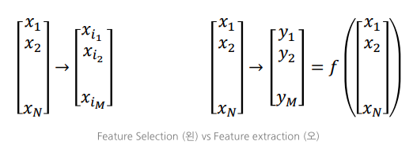
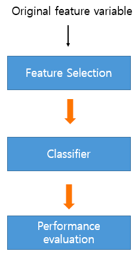
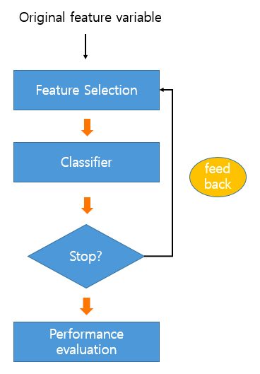
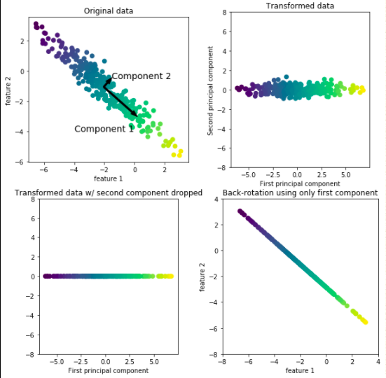

# Feature selection, PCA

## Feature selection?

* 머신러닝의 성능은 **데이터의 양과 질에 굉장히 의존적** 
  * 가상 이상적인 입력 데이터 : 부족하지도, 과하지도 않은 정확한 정보만 포함하는 데이터
* 이러한 데이터를 얻기 위해 보통 취하는 방법
  * 충분한 데이터를 먼저 모으기 (ex : 관측 대상에 센서 붙이기)
  * 데이터 중에서 어떤 feature가 유용한지 아닌지 확인하기
    * 이러한 과정을 **특징 선택(feature selection)** or **특징 추출(feature extraction)** 이라고 함
    * 기존 입력을 토대로 새로운 입력 데이터를 형성 —> learning 과정 전에 실행됨
      * 머신러닝 구조에서 핵심적인 전처리 과정 중 하나

### 장점

* feature가 많으면 모델이 복잡해지고 계산 비용이 많이 들게 됨 —> feature가 적을수록 좋음
* 빠르고 비용 효율적인 모델을 생성할 수 있음
* 데이터를 추출해내는 내부 과정을 더 잘 이해할 수 있음
* 모델의 예측 성능을 향상시킴

### Feature selection vs Feature extraction

둘 다 차원 감소를 사용하는 방법.

* Feature selection : 변환 없이 원래 있는 d개 feature 중 m개만 뽑아 쓰겠다는 것
* Feature extraction : d개 feature를 m차원 공간 벡터로 변환시키는 것

> feature extraction에 대한 optimal linear feature
>
> * signal representation : PCA
> * signal classification : LDA

### 방법1. Filter Method

* 각 feature에 통계적인 점수를 부여하여 점수(score)에 의해 순위(rank)가 결정됨
* 순위가 높은 순서대로 feature로 선택
* 각 feature를 univariate, 독립변수로 봄
* classifier로부터 feedback이 없음

### 방법2.  Wrapper Method

* 모델을 만들고 여러 feature 중, 일정한 개수를 선택하는 조합 (feature의 부분집합 nCm) 들을 테스트하여 조합간의 성능을 테스트
* 가장 높은 성능의 feature 조합을 선택
* classifier로부터 feedback이 존재함
* 계산량이 O(n2)로 많은 편
* forward search와 backward search 두 가지 방식이 있음
  * [여기](http://softgearko.blogspot.com/2014/04/machine-learning-2-feature-selection.html) 참고

### 방법3. Embedded Method

* 어떤 feature가 가장 모델의 성능에 크게 기여하는지 찾아내 feature를 선택
* 학습 (modeling) 과 feature selection이 동시에 수행됨

## Sparse solutions with L1 regularization

> [여기](https://www.inf.ed.ac.uk/teaching/courses/mlpr/2016/notes/w10a_sparsity_and_L1.pdf)를 참고했음

* 모델을 고차원의 feature 벡터들에 맞추려 하면 over-fitting될 위험이 있음.
* 정규화 전략
  * 몇개의 feature 들을 무시하기
  * 몇개의 feature 들을 삭제하기
  * feature 들에 연결된 아무 parameter의 가중치들을 0으로 만들기
* 여러 parameter들을 0으로 만드는 "Sparse" solutions
  * 더 해석하기 쉬워짐
  * 적은 메모리와 적은 계산을 요구함
  * 더 잘 일반화 될 수도 있음 (근데 아닐때도 있음!)

### L1 regularization

#### cost function

* E(w) : training set의 에러
  * square error ...

* L2 보다  L1을 쓰는 이유? [여기](https://www.quora.com/Why-is-L1-regularization-supposed-to-lead-to-sparsity-than-L2) 또는 [여기](https://stats.stackexchange.com/questions/45643/why-l1-norm-for-sparse-models)

## PCA

* Principle Component Analysis 의 약자. 차원 축소의 기술 중 하나.
  * 자율학습의 대표적인 예 2가지 : 분류(clustering) , 차원 축소(dimensionality reduction)
* 차원을 감소시키는 두 가지 방법론
  * feature selection
  * PCA (주성분분석)
* d 차원 벡터를 입력으로 하고 m (m<d) 차원 벡터를 출력으로 하는 (선형) 함수를 만들어내는 방법

* 특성들이 통계적으로 상관관계가 없도록 데이터셋을 회전시키는 기술
  * 회전한 뒤에 데이터를 설명하는데  얼마나 중요하냐에 따라 특성 일부만 선택됨

### 예시 : 인위적인 2차원 데이터셋 사용

* PCA 알고리즘은 성분 1이라고 쓰여있는 분산이 가장 큰 방향을 찾음
  * 이 방향(벡터)는 이 성분 1에 대한 가장 많은 정보를 담고 있는 방향
* 그 다음, 첫번째 방향과 직각인 방향 중 가장 많은 정보를 담고 있는 방향을 찾음 ( 성분 2 )
* 이런 과정을 거쳐 찾은 방향을 데이터에 있는 주된 분산의 방향 —> **주성분** 이라고 함
  * 주성분은 일반적으로 원본 특성의 개수 만큼 있음

* 그림 설명
  * 그림 1 : 원본 데이터 포인트를 색으로 구분해 표시
  * 그림 2 : 주성분 1과 2를 각각 x, y축과 나란하게 회전
  * 그림 3 : 주성분 일부만 남기는 차원 축소로 첫번째 주성분만 유지
  * 그림 4 : 그림 3에서 데이터에 평균을 더해 반대로 회전
* 이러한 변환은 데이터에서 노이즈를 제거하거나 주성분에서 유지되는 정보를 시각화하는데 종종 사용
