# Perceptron
## Artificial Neural Network
: 인공신경망

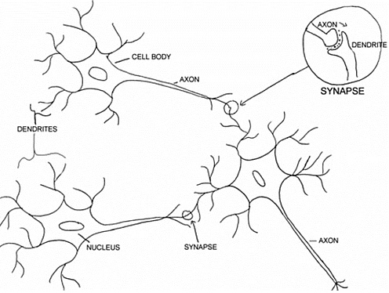

뇌의 학습 기능을 모델화한 일종의 학습 기계.

- 실제 뇌에서 뉴런들이 복잡하게 얽혀서 신경 물질들을 전달하며 동작하는 것과 비슷하게, 뉴런과 유사한 형태인 퍼셉트론을 node로, 퍼셉트론 간 연결(시냅스)를 edge로 하여 graph(network)를 구성한, 인공적인 신경망 형태의 모델.

- 실제 뇌의 신경 단위인 뉴런에서 신호의 이동과정
: dendrites(수상돌기) --> cell body(신경세포체) --> axon(축삭)
	- 이때, 신경세포체에서는 자극이 일정 수준 이상(역치)에 해당하면 반응함.
- 시냅스 : 뉴런 간 연결 부분. 신호 물질을 주고받음 (양방향 아님)

신경과학자인 워렌 맥콜로치, 논리학자인 왈테르 피츠
--> 사람 뇌 신경세포를 하나의 이진 출력을 가지는 단순 논리 게이트로 설명.

1. 여러 개의 입력 신호가 수상돌기에 도착하면 신경 세포 내에서 이들을 하나의 신호로 통합.
2. 신경 세포 내에서 이들을 하나의 신호로 통합.
3. 통합된 신호 값이 어떤 임계값(역치)를 초과하면 하나의 단일 신호가 생성됨.
4. 이 신호가 축삭돌기를 통해 다른 신경세포로 전달됨.

==> 이렇게 단순화된 원리로 동작하는 뇌 세포를 McCulloch-Pitts 뉴런, MCP 뉴런이라고 함.

* * *
## Perceptron?

1975년, 프랭크 로젠블라트 *Frank Rosenblatt* 가 A logical calculus of the ideas immanent in nervous activity 라는 논문에서, MCP 뉴런 모델을 기초로 퍼셉트론(Perceptron)이라는 개념을 고안.
하나의 MCP 뉴런이 출력신호를 발생할지 안할지 결정하기 위해, MCP 뉴런으로 들어오는 각 입력값에 곱해지는 가중치(weight) 값을 자동적으로 학습하는 알고리즘을 제안함.

- 퍼셉트론의 역할 : 주어진 데이터를 0(안 흐른다)과 1(흐른다)로 구분하는 것.

### ***Single Layer Perceptron(SLP)***
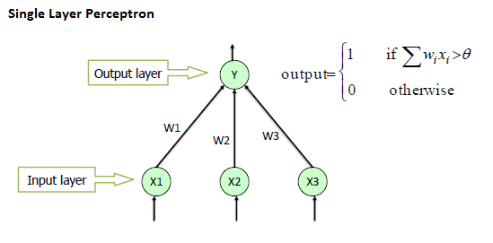

> x : 입력신호, y : 출력신호, w : 가중치

- 각각의 원을 뉴런 또는 노드라고 부름.
- 입력 신호가 뉴런에 보내질 때 각각 고유한 **가중치** 가 곱해진다. 
	- ex) w1 \* x1, w1 \* x2
- 뉴런에서 보내온 신호의 총합이 임계값을 넘을 때 1을 출력한다. 이를 **뉴런의 활성화** 라고 한다.

### ***알고리즘***


- SLP는 선험적 지식(priori knowledge)가 없기 때문에, 초기 가중치는 무작위로 할당된다.
> priori : 선험적, 이전 경험과는 상관이 없는(?), [여기](http://www.saedsayad.com/artificial_neural_network_bkp.htm) 를 참고했음
- SLP는 가중치가 곱해진 신호들을 모두 더해서 만약 그 가중합이 임계치(미리 예상된 값임)을 넘으면, SLP가 활성화됨. (output = 1)
	- 가중합을 만드는 함수를 **순입력 함수** 라고 함.
- 이때 임계값을 적용하는 처리(함수)를 activation function, **활성 함수** 라고 함.
	- 순입력 함수 결과값이 임계값보다 크면 1, 그렇지 않으면 -1로 출력하는 함수.
	- 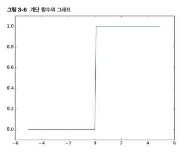
	- 계단 함수 *step function*, 특정 임계값을 기준으로 출력이 바뀜.
- 위 식에서, 편향을 나타내는 bias b를 더하는 과정이 생략되어 있음.
	- 즉,
	x<sub>1</sub>w<sub>1</sub> + x<sub>2</sub>w<sub>2</sub> + x<sub>3</sub>w<sub>3</sub> + b > Θ 인 경우 y=1
    x<sub>1</sub>w<sub>1</sub> + x<sub>2</sub>w<sub>2</sub> + x<sub>3</sub>w<sub>3</sub> + b <= Θ 인 경우 y=0 이 되는 것.
    
	> 여기서 b는 뉴런이 얼마나 쉽게 활성화 되느냐를 조정하는 파라미터. 
	


> 이때 output은 위 사진의 output이랑은 다른 의미.
위 : 출력값, 아래 : 결과값... 대충 이런 개념

### ***가중치 이해하기***

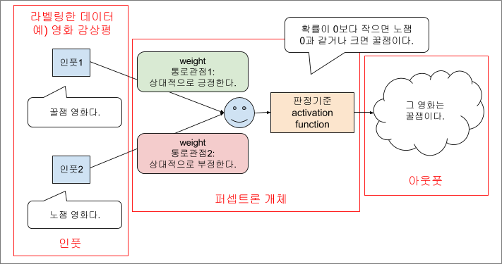

입력값 w : 각각의 입력 신호가 결과에 얼마나 중요한 영향력을 줄지 조정하는 파라미터. 흐름을 통제하는 기능을 함. 
<br>
w값이 커짐 --> 해당 입력의 중요도가 커짐, 더 강한 신호를 흘려보냄.
<br>
w값이 작아짐 --> 해당 입력의 중요도가 작아짐.

1. 각각의 데이터들이 주어지고, 데이터마다 중요도(가중치)가 다르다.
2. 판정 기준(임계값)을 통해 0또는 1같이 이분법의 결과를 도출한다.

==> 사람이 무언가를 결정하는 방식과 비슷함.

## ***가중치의 변화***

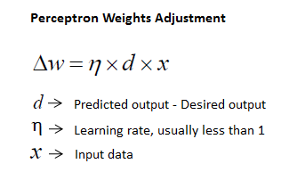

예상 결과 *predicted output* 가 요구되는 결과*desired output*와 같으면, d = 0 이 되어서, performance가 만족 할 만하다고 고려되며, 가중치에 아무 변화도 일어나지 않는다. (변화량 0)

그러나 결과가 요구되는 결과와 맞지 않으면(= *실제 값과 예측 값의 활성 함수 리턴값이 다를 경우* ), 가중치는 차이(error)를 줄이는 방향으로 업데이트, 조정 되어야 한다.

* * *

## 퍼셉트론을 이용한 논리 게이트
### ***AND 게이트***

x<sub>1</sub>|x<sub>2</sub>|y
-|-|-
0|0|0
0|1|0
1|0|0
1|1|1
> AND 게이트 진리표

이때, 입력값(x)은 0이나 1로 정해져 있기 때문에
진리표와 같은 값(y)을 출력하는 방향으로 **가중치, 임계값을 설정** 해주면 된다.

x<sub>1</sub>w<sub>1</sub> + x<sub>2</sub>w<sub>2</sub> + b = **output**

**output > 0** : 활성화 = 1
**output <= 0** : 비활성화 = 0

### ***코드로 구현하기 1***
- output에 따라 결과를 출력하는 함수
```python
def step_function(x):
	return i if x > 0 else 0
```

- neuron 함수
```python
def perceptron_output(weights, bias, x):
	return step_function(dot(weights, x) + bias)
```
3가지 인자 *weight, bias, input* 를 받는다.
dot 함수 : 성분끼리 곱해서 더하는 함수, 
	* *Numpy에 포함 된 함수.*

- AND 게이트 구현하기
```python
perceptron_output([2,2], -3, input)
```

- OR 게이트 구현하기
```python
perceptron_output([2,2], -1, input)
```
함수 인자를 조정해서 OR 게이트도 구현 가능하다.

### ***코드로 구현하기 2***

- AND 게이트 구현하기

bias 인자를 사용하지 않고 애초에 theta를 지정해주는 방식.
실제로는 세타보다는 bias, b를 자주 쓴다고 한다...

```python
def AND(x1, x2):
	w1, w2, theta = 0.5, 0.5, 0.7
    tmp = x1*w1 + x2*w2
    if tmp <= theta:
    	return 0
    elif tmp > theta:
    	return 1
        
AND(0,0)
AND(0,1)
AND(1,0)
AND(1,1)
```

을 실행 후 확인해보면
theta = 0.7 이므로 해당 임계값을 초과하는 값은
tmp = 1*0.5 + 1*0.5 = 1
tmp > theta

AND(1,1) 이 유일하다.

- OR 게이트 구현하기

```python
def OR(x1, x2):
	w1, w2, theta = 1, 1, 0.5
    tmp = x1*w1 + x2*w2
    if tmp <= theta:
    	return 0
    elif tmp > theta:
    	return 1
        
OR(0,0)
OR(0,1)
OR(1,0)
OR(1,1)
```

을 실행 후 확인해보면
OR(0,0)만 0이 리턴되고, 나머지들은 다 1을 리턴한다.

### ***코드로 구현하기 3***
넘파이(Numpy) 배열을 사용해 편향을 도입해서 구현
```python
import numpy as np
x = np.array([0,1])
w = np.array([0.5, 0.5])
b = 0.7
w*x
np.sum(w*x)
np.sum(w*x)+b
```

넘파이 배열끼리의 곱셈은 두 배열의 원소 수가 같다면 각 원소끼리 곱한다.
np.sum() 메서드에서는 입력한 배열에 담긴 모든 원소의 총합을 게산한다.
그 가중치에 편향을 더하면 계산이 완료된다.

위 1번과 같은 개념으로,
AND, NAND, OR의 구조는 모두 같으며 차이는 가중치와 편향뿐이다.
또한, 실제로 입력이 모두 0이어도 편향 값을 출력한다.

* * *

### *** 모든 게이트에서 1과 0의 모든 조합에 대해 특정 출력을 하도록 설계할 수 있을까? ***
**답은 X.**

SLP가 선형 분류이고 케이스들이 선형분리 불가능하다면, 학습 과정은 모든 케이스들이 적절하게 분류되는 지점에 절대 도달할 수 없다. 

XOR 게이트가 가장 유명한 사례인데,
XOR 게이트는 하나의 논리게이트로는 구현이 불가능하다.
수학적으로 XOR 게이트가 선형분리불가능하기 때문이다.

이는 퍼셉트론의 한계인데,
퍼셉트론은 '선형 영역'으로 구분되는 경우만 표현할 수 있다는 것이다.

## 선형 영역 구분?
### ***XOR 게이트***

x<sub>1</sub>|x<sub>2</sub>|y
-|-|-
0|0|0
0|1|1
1|0|1
1|1|0
> XOR 게이트 진리표, A와 B 둘중 한개만 1일때 1 출력

이해를 위해 OR gate 와 비교해보자.

### ***OR 게이트를 평면에 그렸을 때***
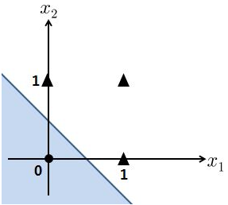
출력이 0인것은 동그라미, 1인것을 세모로 두었을 때
두 영역을 단 하나의 직선으로 '선형 영역' 구분이 가능하다.

선형 표현 --> y=a*x +b 처럼 일차방정식으로 쓸 수 있다는 것.

### ***XOR 게이트를 평면에 그렸을 때***
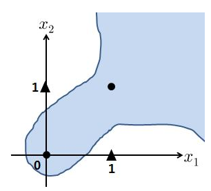
XOR 게이트의 경우 단 하나의 직선으로 두 영역을 나누기에는 한계가 있다! 위에서 말한 선형 영역 구분의 한계.

왼쪽과 같은 곡선 영역을 비선형 영역이라고 함.

이는 다층으로 논리게이트를 쌓아 해결이 가능하다.
원하는 XOR 게이트의 출력값을 내려면 AND, OR, NAND 게이트를 조합하면 된다.
이것을 기반으로 나온 개념이 **다층퍼셉트론, MLP** 이다.

## Multi Layer Perceptron (MLP)
### ***Forward Propagation 순전파***
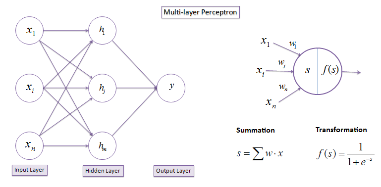
가중치가 계산된 입력값들을 다 더해서 입력값들을 전파시키고, 그 후에 시그모이드 *sigmoid* 함수를 사용해서 계산한다.

퍼셉트론은 기본적으로 입력을 받고 출력을 내보내는 함수와 같은 형태.
각 입력값을 받아들일 때 입력값을 바로 출력하지 않고 일정한 가중치를 곱해 주는데, 이 과정을 앞 먹임 **feed-forward** 이라고 한다.

> feed-forward = forward propagation ?

### ***특징***
- input layer와 out layer 사이에 직접적인 연결이 없음.
- 입력층 - 은닉충 - 출력층 구조
- 은닉층 *hidden layer* 이 많아질수록 복잡한 문제를 해결할 수 있음.

이 신경망의 활성화 함수가 시그모이드 함수인 것.

### ***시그모이드 함수***
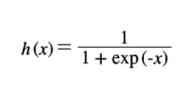
> exp : exponential, 지수

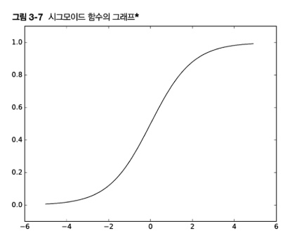
- 기울기 매개변수의 값이 증가할수록 계단 함수 모양에 가까워진다.
- 계단함수와 다르게 출력값이 '연속적'인 것이 특징이다.
> 최근에는 ReLU(Rectified Linear Unit) 함수를 주로 활성화 함수로 이용한다고 한다.

- 차이점
신경망에서는 입력이 '덜 중요하면' 상대적으로 작은 값을 출력하고, 퍼셉트론에서는 아예 0을 출력하는 것이 차이점임. (신경망과 퍼셉트론은 다르다! [여기](https://blog.naver.com/godbswkd123/221348219483) 참고)

- 공통점
	- 최소 출력은 0이고 최대 출력은 1을 넘지 않음.
	- **둘 다 비선형 함수임**
	- 선형 함수는 신경망에서 층을 이루는 의미가 사라지기 때문에(층을 이룰 필요가 없기 때문에) 신경망에서는 꼭 활성화 함수로 비선형 함수를 사용해야 한다.

- 결론적으로, 퍼셉트론과 달리 수동으로 가중치 설정을 해 줄 필요가 없다. 학습을 통해서 적절한 가중치를 뽑아낸다고 한다! 이를 역전파 **back-propagate** 라고 한다.

### ***Backward Propagation 역전파***

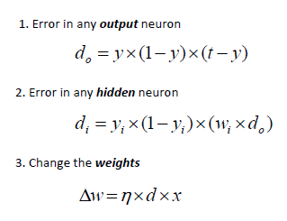

가중치를 곱한 입력값의 결과가 출력이 되는데,
이를 실제 목표 출력치와 비교하여 다음 입력 때에는 출력치가 목표치에 근접할 수 있도록 가중치를 조절하는 과정을 거치는 것, 이 과정이 역전파.

앞 먹임과 역전파를 많은 데이터를 입력하며 번갈아가면서 진행하다 보면 가중치가 데이터에 일반적으로 적용되게 되는데, 이를 인공신경망에서의 학습 ***learning*** 이라고 한다.

## XOR 게이트 문제 해결
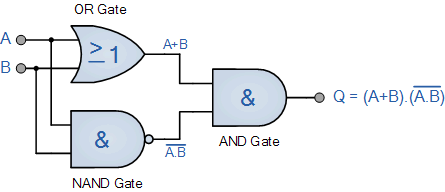

## 궁금한 점, 해결 & 미해결
- 어디선 0과 1, 어디선 -1과 1이라고 하는데 같은 의미인지
	- ** 0 == -1이라고 이해? ** -> !
    - 퍼셉트론은 0과 1, 활성함수는 -1과 1?
    - 0과 1을 출력하는 것은 목적이 무엇이냐에 따라 활성함수가 달라질 수 있다고 한다...

- dot 함수 에러..
	 NameError: name 'dot' is not defined
	- 가상환경 activate 시키고 
```
conda install numpy
```
한 후에 쉘에서
```
python Untitled.py
```
해서 실행시켰는데도 뜬다...

	Untitled.py 파일 내에 dot(weights, x)를 np.dot(weights, x)으로 변경해도
NameError: name 'np' is not defined
에러가 뜬다 ㅠ ㅠ
	
```
import numpy as np
```
이건가봐... 