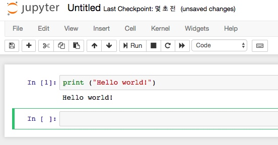

# Jupyter Notebook 설치 및 실행하기
## Jupyter NoteBook?
### ***특징***
- Python과 그 데이터를 사용하는 사람들을 돕기 위해 설계된 대화식 컴퓨터 환경
	- Jupyter notebook에서는 IPYNB 파일을 사용하는데, notebook document라고도 쓰고 확장자는 .ipynb
- ~~Python을 컴파일 방식으로 쓸 수 있게 해줌~~ ?
- 네트워크 연결이 요구됨. (macOS의 경우, 인터넷을 사용함)
- 꼭 Python 뿐만이 아니라, 다른 많은 프로그래밍 언어도 돌릴 수 있음.
- 이전에는 IPython notebook으로 알려져 있기도 했음. 확장자 .ipynb 의 유래이기도 함.
	- 이전에는 파일이 IPython에서 만들어졌었는데 이제는 Jupyter Notebook app에서 만들어짐.
	- Jupyter는 IPython >= 3의 다른 이름!
	- Jupyter notebook은 Ipython notebook보다 더 발전된 interactive IDE로, 다중 kernel을 지원함.
	- 원래 IPython에서는 언어 해석 커널은 기본적으로 한 가지만 지원했다.
커널을 바꿀 수는 있었지만, 커널을 바꾸려면 IPython Notebook 서버를 새로 실행해야만 했다.

### ***설치***
- 설치 전, Python 2.7이나 3.3 이상이 요구됨.
- Anaconda를 설치할 때 자동으로 설치되어 있음.
- 설치할 때 [IPython](https://ipython.readthedocs.io/en/latest/) kernel 설치가 포함되어 있음. 이는 Python 언어 사용을 위해 설치되는 것
> kernel은 Jupyter에게 프로그래밍 언어 지원을 해 줌.IPython이 기본 커널이고 추가적인 커널로는 R, Julia 등이 있음.
- pip(Python package manager)로 설치할 경우에는 [여기](https://jupyter.readthedocs.io/en/latest/install.html) 또는 [여기](http://jupyter.org/install.html)를 참고

### ***실행***

1. 터미널에 아래 명령어를 입력해서 notebook 서버를 시작시켜준다.
```
jupyter notebook
```
> anaconda navigator에서 jupyter를 Launch 해도 똑같이 실행되는 것 같다.

2. 터미널창에 웹 어플리케이션의 URL( 디폴트 ```http://localhost:8888``` )을 포함한 여러 정보들이 뜬다.

3. 브라우저에 Jupyter가 열리면 Notebook Dashboard를 확인할 수 있다.<br>
Notebook 파일들의 목록과, Notebook 서버가 시작된 디렉토리의 서브디렉토리들을 보여준다.<br>
보통 Notebook 파일들이 포함되어있는 가장 상위 디렉토리가 홈 디렉토리가 된다.<br>


### ***커맨드 라인 옵션들***
- **특정 Notebook 파일 열기**
```
jupyter notebook notebook.ipynb
```
위 코드를 실행하면 현재 열려있는 notebook 서버에서 notebook.ipynb 파일이 열린다.
<br>필요하다면 notebook 서버를 시작한다.

- **특정 IP나 포트에서 Notebook 시작하기**
```
jupyter notebook --port 9999
```
jupyter notebook의 기본 포트는 8888인데, 8888 포트를 사용할 수 없을 땐 
<br>노트북 서버가 알아서 사용 가능한 포트를 찾는다. 위 코드 처럼 포트를 직접 지정해 줄 수도 있다.

- **브라우저 없이 Notebook 서버 열기**
```
jupyter notebook --no-browser
```

- **도움말 보기**
```
jupyter notebook --help
```
```--help``` 플래그를 사용한다.

* * *
### ***Tensorflow에서 가상환경 만들고 설치, 실행하기***
```
//pip 업데이트를 먼저 확인 해 줌.
(tensorflow)$ pip3 install --upgrade pip
```
```
// 가상환경 실행
$ source ./bin/activate
```
```
//Jupyter를 pip를 통해 설치.
//Python 2.x를 설치할 경우
(tensorflow)$ pip install jupyter
//python 3.x를 설치할 경우
(tensorflow)$ pip3 install jupyter
```
```
// Jupyter notebook 실행
(tensorflow)$ jupyter notebook
```

<br>
여기까지 하면, 브라우저에 열린 Notebook dashboard에서 New > Notebook에
<br>Python3이 붙어있는 것을 확인 할 수 있다.

>만약 아무 모듈도 붙어있지 않다면, [여기](http://zudog.tistory.com/entry/IPython-Notebook)를 참고

## Hello world!

<br>
여기서 ```Python3```을 클릭하면 새 파일을 만들 수 있다.

<br>
위 Run 버튼을 누르면 되고, autosave를 지원한다. ```command + s```를 누르면 저장된다.
<br> Run 단축키는 ```shift + enter```, Keyboard shortcuts에 가면 더 많은 단축키를 볼 수 있다.

<br>
다시 대시보드로 나와 보면 ipynb 파일이 새로 만들어진 것을 확인할 수 있다.