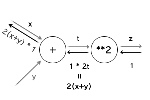
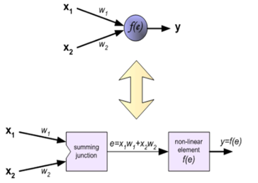
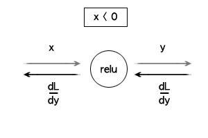
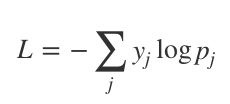
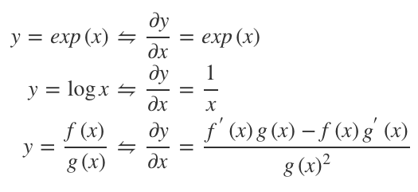
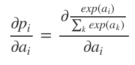
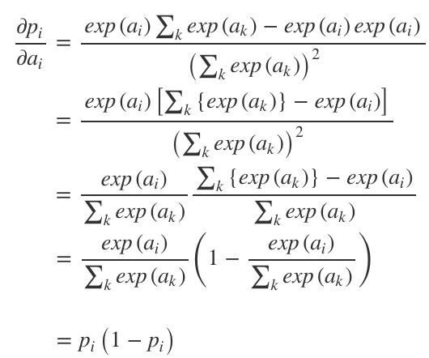
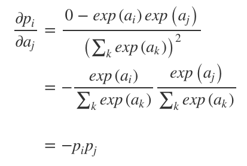
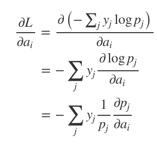

# 오차역전파 알고리즘 (Backpropagation Algorithm)

##순전파 (Forward propagation)

* 정보가 input layer —> hidden layer —> output layer로 진행
  * 이때 얻은 y값들을 실제 값과 비교해서 error들을 계산하는 과정
* 입력으로 제공된 training data를 이용해서 cost functionn을 구하고, 한 Layer씩 계산해 나아가는 것.

###일반적인 전체 순서

1. 0에 가까운 작은 숫자로 weight값들을 주고 random으로 시작.
2. dataset 중 first observation을 input layer, one input node에 넣어줌.
3. 왼쪽에서 오른쪽으로, weight 값들에 따라 각각의 neuron activation이 영향받는 방식으로 forward propagation이 진행됨. 원하는 예상 값들이 나올 때 까지 propagation 진행.
4. 예상 값과 실제 값을 비교하고 error 계산.
5. 오른쪽에서 왼쪽으로 back propagation을 진행.
   1. weight들이 다시 계산됨.
   2. 이 과정을 통해 얻어지는 learning rate를 parameter로 사용하여 neural network를 control
6. 1~5 단계를 반복하면서 각각의 observation에 따른 각각의 weight들을 업데이트.
   1. 이 과정을 Reinforcement Learning이라고도 함.
7. 모든 training set이 artificial newral network를 거치면 epoch를 만들고, epoch를 반복함.
   1. Neural network가 원하는 값을 만들어 내도록, cost function 값이 최소화가 되도록 epoch를 반복.

## 합성함수

* 함수를 연속적으로 2개 이상 거치는 것.
* 함수 f : 정의역 X, 공역 Y
* 함수 g : 정의역 Y, 공역 Z

==> Y는 f의 공역임과 동시에 g의 정의역이 됨.

### 표현

위의 합성함수는 먼저 f에 의해 대응되고, 그 다음에 함수 g에 의해 대응됨.

* g(f(x))
* g ∘ f(x)
* (g ∘ f)(x)

> g(f(x))라는 함수는 합성 순서가 g—>f가 아닌 f—>g

### 합성함수의 미분

* 두 함수 y = f(x)와 z = g(y)가 미분가능할 때, 합성함수 z = (g ∘ f)(x) = g(f(x))는 미분가능하고

  

  즉,  z' = g'(f(x))f'(x)

* ex)

  * z = (x+y)2
  * z = t2, t = x+y
  * dz/dx = dz/dt ∘ dt/dx = 2t * 1 = 2(x + y)

## 연쇄법칙

* 여러 함수로 구성된 함수인 합성함수의 미분은 **그 합성함수를 구성하는 각각의 함수의 미분의 곱**으로 나타낼 수 있다.

* dz/dz  ∘  dz/dt  ∘ dt/dx = dz/dt ∘ dt/dx = dz/dx
  * 역전파의 연쇄법칙을 이용하면 결국 해당 변수에 대한 미분과 같다.

## 역전파 알고리즘

* 최적의 학습 결과를 찾기 위해 역방향으로 에러를 전파시킴.

* 출력에서 생긴 오차를 반대로 입력 쪽으로 전파시키면서 w와 b값들을 갱신시켜 간다.
* Cost function이 w와 b의 함수로 이루어져 있음
  * 출력 부분부터 시작해서 입력 쪽으로 (역방향) 순차적으로 cost function에 대한 편미분을 구함
  * 얻은 편미분 값을 이용해 w와 b의 값을 갱신
* 모든 훈련 데이터에 대해서 이 작업을 반복적으로 수행하다 보면 훈련 데이터에 최적화된 w와 b 값들을 얻을 수 있음.

### 뉴런의 재구성

> 역전파 이해(편미분 부분)를 쉽게 하기 위함

입력을 합하는 부분 & 활성화 함수 부분을 나누어 생각

F(e) : sigmoid 함수

e : 각 넷으로부터 입력과 가중치의 곱의 총합

### 기본 스텝

1. Feed forward (앞먹임)
   1. 왼쪽에서 오른쪽으로 계산. 오른쪽 반원에 있는 부분을 수행
   2. 모든 넷에서 들어오는 입력의 합을 sigmoid 함수를 거쳐서 출력
   3. 입력이 최종 출력까지 전달됨.

2. Back - propagation
   1. 최종 출력단에서 구한 기대 출력과 실제 출력간의 차 (error)를 반대 방향으로 전파시키면서 각각 넷이나 뉴런의 가중치(w)와 bias 값 갱신
   2. 오른쪽에서 왼쪽으로 계산. 왼쪽 반원에 있는 부분을 수행
   3. 에러를 역전파할 때에는 sigmoid의 함수의 미분 함수 s'를 사용하고 각 net으로 모두 동일하게 전파

* 정리

  * feedforward & back propagation의 2단계로 구성
  * feedforward : 훈련데이터를 신경망에 인가하고 출력단에서의 에러와 cost function을 구한다
    * 신경망이 충분히 학습이 되지 못한 경우는 오차가 클 것.
    * 그 큰 오차 값을 backpropagation 시키면서 가중치와 바이어스 값을 갱신한다.
  * 훈련 데이터에 대해서 반복적으로 이 과정을 거치게 되면 가중치와 바이어스는 훈련데이터에 최적화된 값으로 바뀌게 됨.
  * 좋은 학습 결과 : 훈련 데이터가 한 쪽으로 치우치지 않고 범용성을 가져야 함

### Sigmoid의 역전파

- sigmoid를 쓰는 이유

  - Backpropagation을 해석하기에 편리한 sigmoid 함수의 미분 성질

  * 덧셈, 곱셈, 나눗셈, exp에 대한 역전파를 계산하여 구할 수 있지만 순전파의 출력(y) 만으로도 계산할 수 있음.

  

  

## ReLU의 역전파

* 순전파때의 입력값이 0보다 크면 역전파는 상류의 값을 그대로 하류로 흘러보낸다.

   

* 순전파때의 입력값이 0 이하이면 하류로 신호를 보내지 않는다 ( 0을 보낸다. )

  

## Softmax-with-Loss-Layer

> 분류해야 할 범주 수 n, 함수의 i번째 입력값 ai i번째 출력값 pi
>
> 소프트맥스 함수의 입력 및 출력벡터의 차원수 : n

* 소프트맥스 함수는 범주 수 만큼의 차원을 갖는 입력벡터를 받아서 확률로 변환해 줌.
* 그 후 크로스엔트로피를 사용해 소프트맥스 확률의 분포와 정답 분포와의 차이를 나타냄.

* 딥러닝 모델의 손실(오차) L은 다음과 같이 크로스엔트로피로 정의된다. (스칼라 값)

> 정답 벡터의 j번째 요소 yj, 소프트맥스의 j번째 출력값 pj

### 관련 미분 기초 공식

### 소프트맥스 함수의 그래디언트

* pi, pj 에 대한 Softmax-with-Loss 계층의 i번째 입력값 ai의 그래디언트.

#### i = j인 경우 

exp(ai) 를 f, 분모 ∑kexp(ak) 를 g로 보고 위 미분공식을 활용해 다시 적으면

∑kexp(ak) 를 ai에 대해 편미분한 결과는 exp(ai)를 제외한 나머지 항은 상수 취급돼 소거됨

—> g'는 exp(ai)

#### i != j인 경우

pi 는 분수형 함수이므로 분자 exp(ai)를 f, ∑kexp(ak) 를 g로 보고 미분공식을 활용해 적은 것.

그런데 exp(ai) 를 aj 에 대해 편미분하면 0이 되므로 f'g도 0이 됨.

 ∑kexp(ak)를 aj 에 대해 편미분한 결과는 exp(aj)를 제외한 나머지 항은 상수 취급돼 소거되므로 g'는 exp(aj)가 된다.

### 역전파

손실에 대한 Softmax-with-Loss 계층의 i번째 입력값 ai의 그래디언트는 다음과 같이 유도

소프트맥스 함수의 그래디언트 (dpj / dai)는 i와 j가 같을 때와 다를 때 도출되는 값이 다름

—> 위 식의 시그마 부분에서 i번째 입력값에 해당하는 요소를 분리해 두 개의 항으로 표현

> 여기서 소프트맥스 확률의 합  ∑jyj는 1

###그림으로 정리하기

* 신경망의 마지막단게의 계층으로 softmax 계층과 손실함수인 Cross Entropy Error 계층이 포함된 계층

